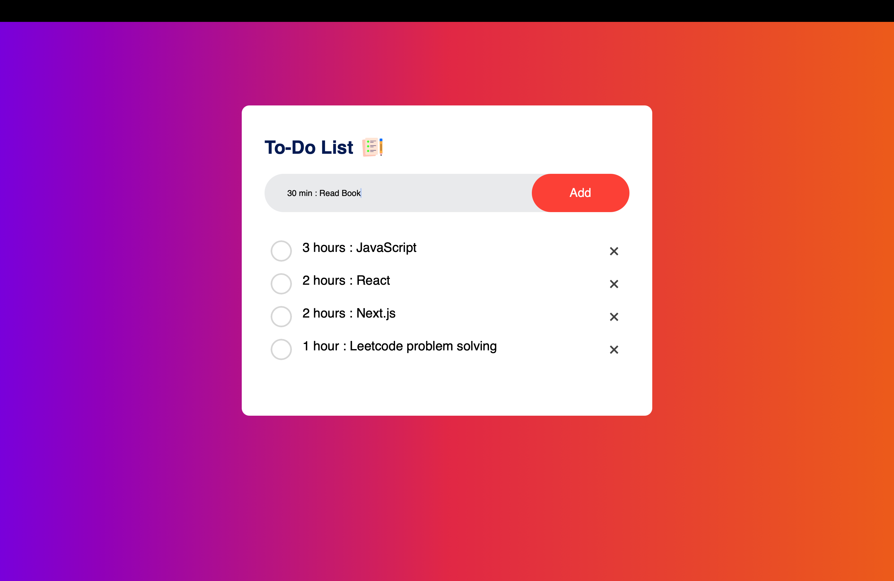

# To-Do List

This is a simple and efficient To-Do List application. It allows users to add, delete, and mark tasks as complete. The app is designed with a clean user interface and provides a seamless task management experience.

 

## Screenshots

### Initial View

### 2. Added Task

### 3. Completed Tasks

 

## Features

- Add new tasks
- Mark tasks as completed
- Delete tasks
- Persistent storage using local storage (if implemented)
- Responsive design for desktop and mobile users

 

## Technologies Used

- HTML5
- CSS3
- JavaScript

 

## Conclusion

The To-Do List project offers essential functionalities like adding, completing, and deleting tasks while maintaining a clean and responsive design. It also provides a solid starting point for anyone looking to strengthen their skills in HTML, CSS, and JavaScript through a practical and useful application.

## License

This project is open-source and available under the MIT License.

