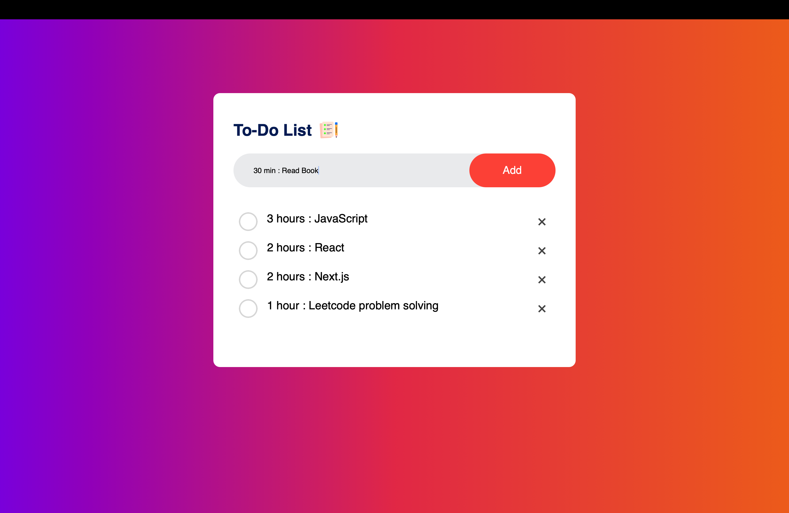

# To-Do List

A **To-Do List** is a task management application that enables users to create, read, update, and delete (CRUD) task entries. It typically includes features like task categorization and completion status toggling.It supports real-time updates and persistent data storage. The application emphasizes UI responsiveness, and user-friendly interaction design.

 

## Screenshots

### Initial View

### 2. Added Task

### 3. Completed Tasks

 

## Features

- Add new tasks
- Mark tasks as completed
- Delete tasks
- Persistent storage using local storage (if implemented)
- Responsive design for desktop and mobile users

 

## Tech Stack 

- **HTML5**
- **CSS3**
- **JavaScript**

 

## Conclusion

The **To-Do List** app showcases web development concepts like DOM manipulation, event handling, and dynamic data rendering using HTML, CSS, and JavaScript. It provides core functionalities such as adding, deleting, and marking tasks as complete. This project serves as a strong foundation for beginners to understand interactive UI development and can be extended with features like local storage or task filtering.

## License

This project is open-source and available under the [MIT License](https://opensource.org/licenses/MIT).

