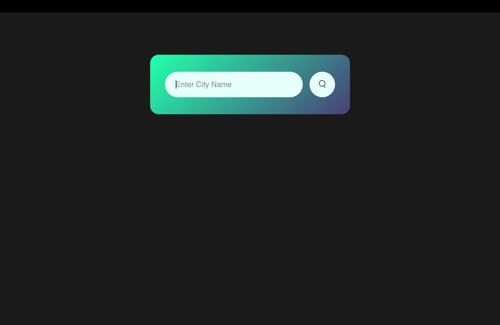
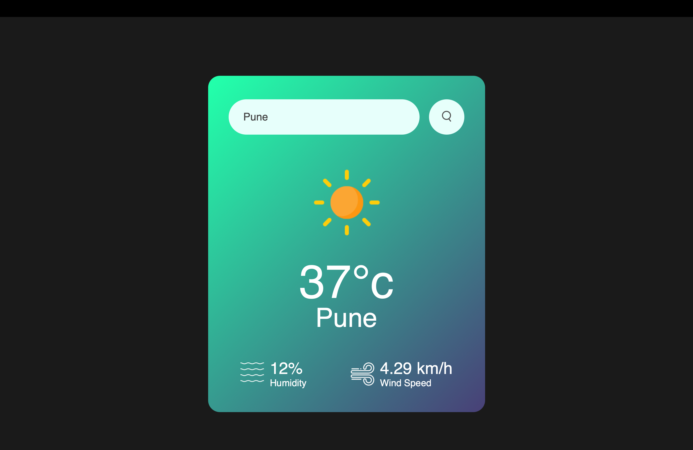

# 🌤️ Weather App

The **Weather Web App** is a real-time weather tracking application built using the core front-end technologies: **HTML**, **CSS**, and **JavaScript**. It provides users with instant weather information for any location they search, leveraging external APIs to fetch accurate and up-to-date weather conditions.

Designed to be **lightweight**, **fast**, and **responsive**, the app serves as both a **utility** and a **demonstration** of:

- Dynamic web programming
- API integration
- Front-end development principles


#
<br>

  
##  Screenshots

###  Search View


###  Weather Display View


#
<br>

##  Tech Stack

- **HTML5**
- **CSS3** – Gradient UI with modern design
- **JavaScript** – API calls and DOM manipulation
- **OpenWeatherMap API**

#
<br>

##  Features

-  City-based weather search
-  Real-time temperature display in Celsius
-  Humidity and wind speed information
-  Dynamic weather icons
-  Clean and responsive UI with gradient effects

#
<br>

##  How to Run

1. **Clone the Repository**
   ```bash
   git clone https://github.com/yourusername/weather-forecast-app.git
   cd weather-forecast-app

2.	**Open index.html in Your Browser**
    - You can either open the file directly:
     ```bash
     open index.html
     ```

    - Or use a live server (recommended for development).

3.	**Enter a City Name**
	  - Start typing any city name and press the search icon to get the latest weather data.

#
<br>

##  API Configuration

This project uses the **OpenWeatherMap API**. To make it work:

1. Sign up at [OpenWeatherMap](https://openweathermap.org/api) and get your API key.
2. In your JS file, replace the placeholder with your API key:

   ```js
   const apiKey = "YOUR_API_KEY_HERE";

#
<br>

##  Author

**Jatin Mahajan**  
 Passionate about front-end development, UI/UX design, and automation tools.  
 [LinkedIn](https://www.linkedin.com/in/jatinm9)  
 Feel free to reach out for collaborations!

#
<br>

## 📄 License

This project is open source and available under the [MIT License](https://opensource.org/licenses/MIT).
  
